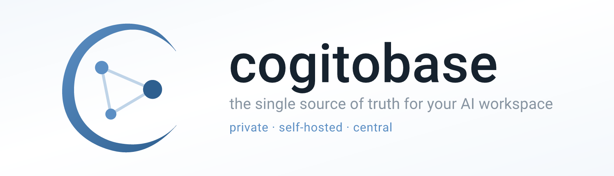
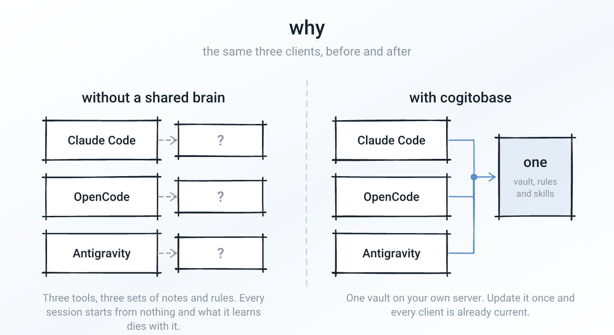
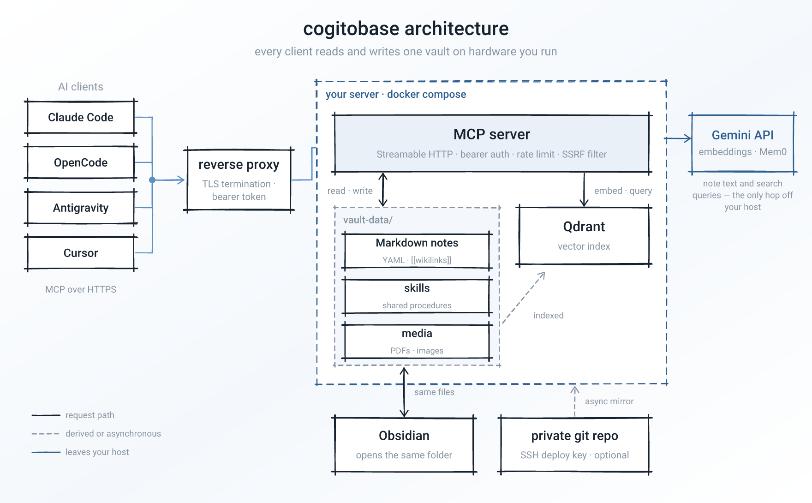
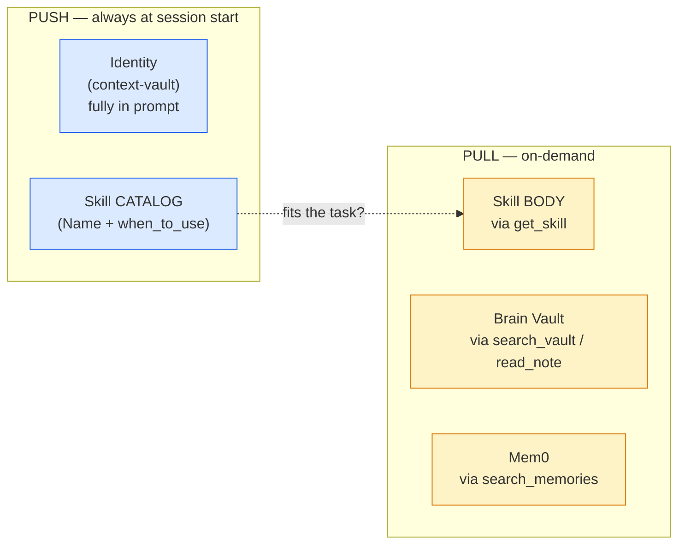
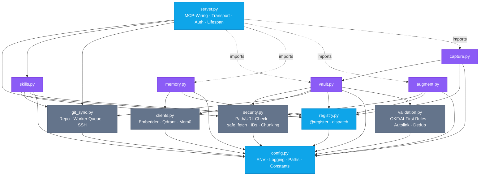
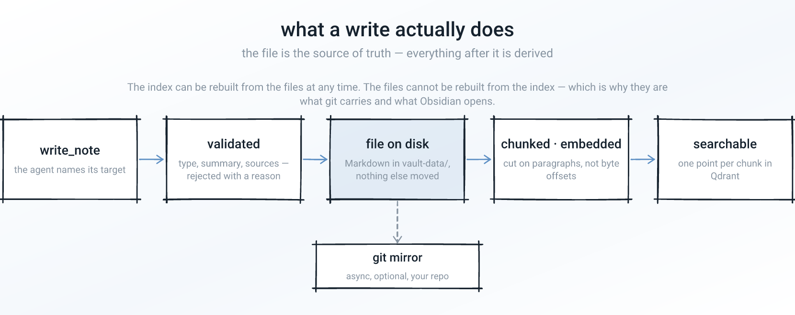
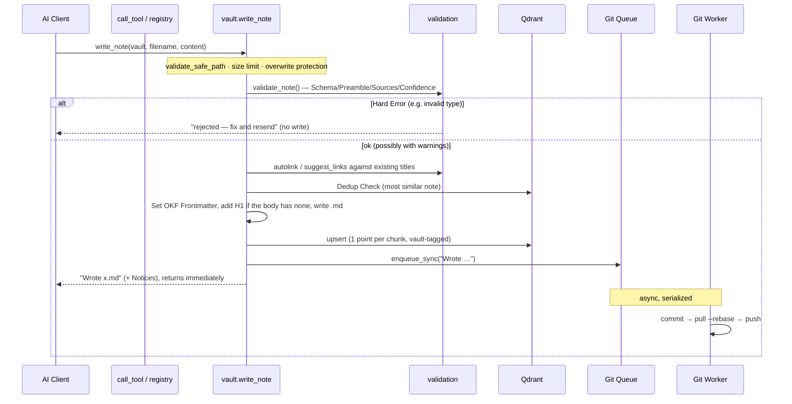
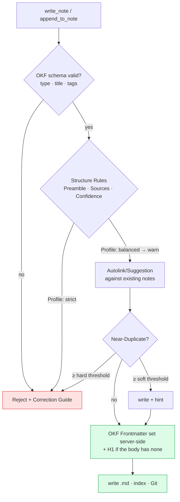
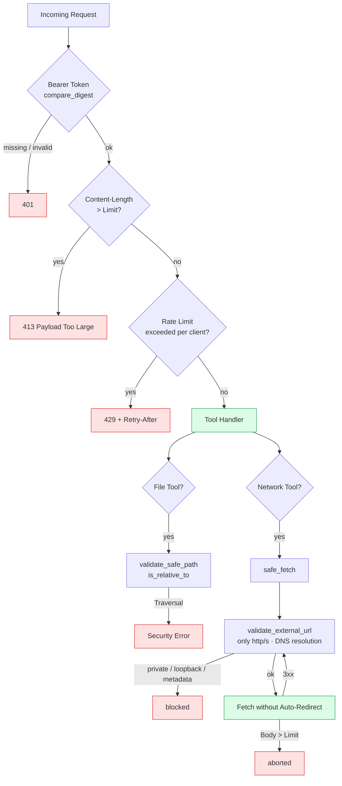
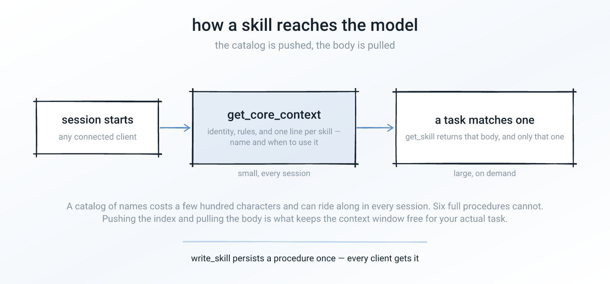

<p align="center">
  
</p>

# cogitobase
**the single source of truth for your AI workspace**
*private · self-hosted · central*

<p align="center">
  
  
  
  
</p>

**cogitobase** is a self-hosted [Model Context Protocol (MCP)](https://modelcontextprotocol.io) server that gives every AI client you use one shared, searchable second brain: a folder of Markdown files on your own machine, semantically indexed, reachable over HTTP.

Every time you switch devices or open a new client, your AI starts from nothing. It has no memory of your project guidelines, your workflows, or anything you told the last one. cogitobase is the one place all of them read from and write to.

<p align="center">
  
</p>

**Who it is for:** someone who already keeps notes in Markdown — an Obsidian vault, a docs folder — uses more than one AI client, and would rather run a container than hand that material to a hosted service. It expects you to be comfortable with Docker, a reverse proxy, and reading a log when something breaks.

**What it is not:** not a chat UI, not a hosted product, not an Obsidian plugin, and not multi-tenant — one deployment serves one person's brain.

### ✨ Key Benefits
- 🧠 **One Central Brain:** Share your identity, rules, and knowledge across all your AI clients (desktop, terminal, mobile). Update once, synced everywhere.
- 📝 **Plain Markdown, Obsidian-compatible:** Your knowledge lives in plain-text Markdown files with YAML frontmatter and `[[wikilinks]]` — point Obsidian at `vault-data/` and it just opens. No database to export from, no proprietary format, no plugin to install. Optionally mirrored to a private Git repo you own.
- 🔒 **Your files stay yours:** No pre-existing note is ever moved, renamed, or rewritten behind your back. Every write is a tool call naming its target, and rebuilding the index only reads. What *does* leave your server: note text and search queries go to the **Gemini API** for embeddings — [`PRIVACY.md`](./PRIVACY.md) enumerates every byte, and "private" here means *infrastructure you control*, not zero egress.
- 👁️ **Multimodal Retrieval:** Powered by Qdrant & the Gemini API, agents can semantically search through text, PDFs, and images.
- 🤖 **Autonomous Read/Write:** Agents don't just read – they can autonomously document decisions, write notes, and update your brain while respecting strict validation rules.
- 🛠️ **Unified Skills:** Write a procedure once and every connected client loads the same body on demand — your code editor and your web chat work from identical instructions.

### Status & cost

**1.0.0** — the first release. Single-tenant by design: one
deployment serves one person's vault, behind your own TLS and Bearer token. The tool
surface is stable from here; breaking changes get a major version. The test suite runs on
every push (see [Tests](#8-tests)) and covers the write, auth, and sync paths.

Running it costs you the machine it runs on — the server and Qdrant are both self-hosted,
with no local model weights to download — plus **Gemini API usage** for embeddings and
Mem0's LLM calls. Embedding is per note written and per search issued, so cost scales with
how much you write and search, not with vault size. Check Google's current pricing for the
models in `EMBED_MODEL` / `LLM_MODEL`; there is no cogitobase-side fee and no hosted tier.

Licensed **AGPL-3.0** ([LICENSE](LICENSE)) — running a modified version as a network
service obliges you to publish those modifications.

---

## Quickstart

Prerequisites: Docker & Docker Compose, and a Google Gemini API key.

```bash
git clone https://github.com/mdorloechter/cogitobase.git && cd cogitobase
cp .env.example .env                                  # set AUTH_TOKEN (openssl rand -hex 32) and GEMINI_API_KEY
cp docker-compose.yml.example docker-compose.yml      # adapt to your host; the copy is git-ignored
docker compose up -d --build
curl localhost:8000/healthz   # → ok
```

Then point a client at it:

```bash
claude mcp add --transport http my-brain http://localhost:8000/mcp \
  --header "Authorization: Bearer YOUR_AUTH_TOKEN"
```

Git sync and the SSH deploy key are **optional** and ship disabled — the Quickstart above
runs local-only. Set `GIT_REPO_URL` to a repo you own to enable the remote mirror. For
remote access, TLS, and the full walkthrough see **[INSTALL.md](INSTALL.md)**.

Before pointing this at sensitive notes, read **[PRIVACY.md](PRIVACY.md)** (what leaves
your server, and the limits of deletion) and **[SECURITY.md](SECURITY.md)** (threat
model). The short version: the vault stays on your host, embeddings go to the Gemini
API, and Google's **free tier may train on what you send** — use a paid key or Vertex AI
for a personal Second Brain.

---

## 1. System Overview

<p align="center">
  
</p>

The server itself is **"dumb"**: no built-in LLM, no autonomous routing. It provides tools; the intelligence lives in the client and is steered via an injected meta-prompt. The `.md` files are the *Source of Truth* — Qdrant is just a rebuildable index, Git the durable backup. Multimodal content (images, PDFs) are natively supported and linked as visual vectors in the index.

Mem0 holds the implicit half of the memory — facts inferred from how you work rather than notes you asked for — and stores its vectors in the same Qdrant instance.

---

## 2. The Four Memory Pillars

The core trick is the different **loading behavior** (push vs. pull): What the AI always needs is pushed; the rest is pulled on demand.

Two of the pillars live in directories that come up throughout this document: the **context-vault** holds who you are — identity, standards, AI rules — and is small enough to be pushed in full; the **brain-vault** holds your actual notes and is far too large for that, so it is searched. Both sit under `vault-data/` (the layout is spelled out [below](#canonical-vault-layout)).



| Pillar | Storage | Purpose | Loading |
|-------|--------|-------|-------|
| **Identity** | `context-vault/` | Who you are, coding standards, AI rules | **push** — via `get_core_context`, triggered by the startup `instructions` field |
| **Skills** | `skills/` | Reusable procedures | **Catalog push, Body pull** |
| **Brain** | `brain-vault/` | Notes, projects, knowledge | **pull** — semantic search |
| **Mem0** | Qdrant | Atomic, categorized preferences | **pull** — semantic search |

**Why load skills hybridly?** If every skill were completely embedded in the prompt (like identity), the context would bloat with every new skill. Instead, the AI sees only a compact catalog (name + purpose) and targets the expensive body via `get_skill` when a task fits. This scales the skill base without diluting every session.

### Canonical Vault Layout

Every note follows **OKF** (Open Knowledge Format) — the convention that a Markdown file should read well for a human *and* parse reliably for a machine. Concretely, this server requires: frontmatter carrying `date`, `type`, `tags` and `ai-first`; an H1 title; and an `## AI Summary` section that states up front what the note is about. The server writes the frontmatter itself, and supplies the title when the body brings no heading of its own, so a client cannot get either wrong — §5 covers what is enforced and how strictly.

Notes are filed into a **fixed** set of folders so the graph stays navigable no matter which client writes. Each note's `type` **is** its folder (one axis, no separate "genre" type); genres like a retro, a devlog entry, or an ADR are body *sections* inside a note, not their own type. The `capture_session_retro`/`capture_inbox` tools write into `projects/`/`inbox/`; the `zettelkasten-discipline` skill steers everything else into the same layout (it is the authoritative source for these conventions).

```
vault-data/
├── context-vault/            # Identity (pushed): who you are (identity), standards
├── brain-vault/              # Knowledge (pulled via search)
│   ├── daily/                #   chronological backbone — daily/YYYY-MM-DD.md
│   ├── people/               #   one atomic note per person          (type: person)
│   ├── companies/            #   one atomic note per company/org      (type: company)
│   ├── tech/                 #   technologies / tools / libraries     (type: tech)
│   ├── concepts/             #   abstract concepts / ideas            (type: concept)
│   ├── projects/             #   projects, meetings, devlogs, retros  (type: project)
│   ├── research/             #   research / investigation logs        (type: research)
│   ├── decisions/            #   architecture/design decisions (ADRs) (type: decision)
│   ├── learnings/            #   reusable learnings                   (type: learning)
│   └── inbox/                #   fast, not-yet-sorted captures — graduate later (capture_inbox)
├── skills/                   # Reusable procedures (catalog pushed, body pulled)
└── media/                    # PDFs & images, linked as ../media/<file>, indexed natively
```

---

## 3. Module Architecture

`server.py` stays thin: the logic is divided into focused modules; tools register via a **Registry Pattern** (`@register`) instead of a large `if/elif` chain. A new tool is a local change (a decorator), not a new branch in a 300-line function.



| Module | Responsibility |
|-------|---------------|
| `config.py` | ENV, Logging (stderr), Paths, Constants, Fail-Closed-Token |
| `registry.py` | Tool Registry + Dispatch |
| `security.py` | Path Traversal Protection, SSRF Filter, `safe_fetch`, Point IDs, Chunking |
| `validation.py` | OKF/AI-First Invariants, Autolink, Dedup Rules (server-side enforcement) |
| `clients.py` | Embedder / Qdrant / Mem0 — degrade individually to `None` |
| `git_sync.py` | Clone, Sync (commit→pull→push), serialized worker, SSH Auth, Conflict Pause |
| `ratelimit.py` | In-Memory Sliding-Window Limiter (Ingress DoS Protection) |
| `observability.py` | Structured JSON Logging, Request IDs, dependency-free Prometheus metrics |
| `vault.py` · `memory.py` · `augment.py` · `skills.py` · `capture.py` | The tool groups |
| `server.py` | MCP Protocol Wiring, Streamable HTTP Transport (`/mcp`), Protection Middleware (Auth + Limits), Lifespan, Health endpoints |

> Modules reference `config.X` at runtime (not the value at import). This makes them individually importable and testable via monkeypatching — `clients.py` also encapsulates API dependencies and degrades to `None` so logic tests can run locally without Gemini/Mem0 API Keys.

---

## 4. Data Flow: Writing a Note

<p align="center">
  
</p>

`write_note` shows the interaction of validation, index, and non-blocking Git synchronization:



The caller **does not** wait for the Git push — all write tools put a job in the queue and return immediately. A single worker serializes Git operations so parallel write accesses and the 15-minute cron don't overlap. If a `pull --rebase` fails due to a conflict, the local work is parked on a `conflict-*` branch and auto-sync is **paused** (instead of creating new conflict branches every cycle) until the divergence is manually resolved.

The **Capture Tools** (`capture_session_retro`, `capture_inbox`) are a thin upstream layer: they build the OKF body from structured fields and internally call exactly this `write_note`/`append_to_note`, with the same validation, index and Git queue. No enforcement is duplicated. A capture tool only earns its place when it adds real write *logic* (e.g. `capture_session_retro`'s create-vs-append) or removes friction the enforcement would otherwise impose; plain field→heading mapping is left to the `zettelkasten-discipline` skill. The mapping stays mechanical: a capture tool arranges the fields it is given and never writes the *content* of one. `capture_inbox` therefore takes an optional `summary` rather than deriving it. With none, the note carries a labelled excerpt of itself, because an unmarked first-few-lines is indistinguishable from a summary the client actually wrote.

### Data Integrity: Server-Side Enforcement

The OKF/AI-First rules don't just live in the prompt — the server enforces the **mechanically testable** invariants on *every* write access, no matter which client writes (see ADR 1 "Validating Server"). Rule of thumb: the server checks *well-formedness*, never *truth/sense*.



Strictness is configurable via `VAULT_ENFORCEMENT` (`strict` / `balanced` / `lenient`) plus per-rule overrides; `VAULT_AUTOLINK` controls linking (`off` / `warn` / `auto`). Unambiguous rules (schema) are hard, heuristics (sources/confidence) are soft to avoid false-positive blocks.

---

## 5. Security

Because the server (unlike the source skill) is **exposed**, it was specifically hardened against typical MCP attack vectors.



1. **Fail-Closed Auth** — the server will not start unless `AUTH_TOKEN` is a real secret: not empty, at least 16 characters, ASCII, and not one of the placeholders shipped in `.env.example` or the docs. Token comparison via `secrets.compare_digest`.
2. **Ingress Limits** — the `ProtectionMiddleware` rejects oversized requests (`413`, via `Content-Length`) after auth and throttles per client (sliding window, `429` + `Retry-After`), keyed by the hashed bearer token. Both checks run *after* the auth check, so the limiter is a backstop against a runaway tool or a leaked token, and does **not** throttle token guessing — bounding unauthenticated request rates is the reverse proxy's job, where the real client address is known.
3. **Path Traversal** — every file and resource access goes through `validate_safe_path` (`resolve()` + `is_relative_to`), consistent for both read *and* write paths.
4. **SSRF** — all external fetches pass through `safe_fetch`: only http/https, DNS resolution blocking private/loopback/link-local/**metadata** IPs (`169.254.169.254`), optional domain allowlist. **Redirects are not followed automatically**, instead each hop is re-validated. To prevent DNS rebinding (TOCTOU), the **validated IP is pinned**: connection is made exactly to the checked address, while Host header and TLS SNI remain on the real hostname (certificate check intact).
5. **DoS** — 2 MB per vault file, 10 MB per media upload (`MAX_MEDIA_BYTES`, decoded), 5 MB per external download (checked streaming), 4 MB per request (ingress), 50k characters per `ingest_media` result, fetch timeouts. The ingress cap is the binding one for uploads: base64 inflates a payload by 4/3, so ~3 MB of binary is what fits through the default 4 MB.
6. **Git Credentials** — Auth via a **read-only mounted SSH Deploy Key**. A `GIT_REPO_URL` that embeds a credential is refused at startup (`config.ensure_git_repo_url`), because git echoes the URL in its own error output and the credential would land in the logs verbatim — GitPython masks only the command line it builds, not git's stderr.
7. **Container** — runs as non-privileged `mcpuser`; port 8000 published on **loopback only** (`127.0.0.1`), never `0.0.0.0`, so the reverse proxy on the same host reaches it and the network does not.
8. **Logging** — diagnostics/errors go to **stderr**, stdout remains free (MCP convention).

---

## 6. Available MCP Tools

In total, the server registers **27 tools** across six groups.

### A · Vault (Explicit Knowledge)
| Tool | Description |
|------|--------------|
| `search_vault` | Semantic search (Filters: `brain` / `context` / `media` / `all`, `limit` 1-20, default 5); each hit is named by its vault-qualified path and carries its relevance score |
| `list_notes` | List files in a vault (`brain` / `context` / `media`); notes are named by their vault-qualified path, media by basename |
| `read_note` | Read Markdown content including frontmatter |
| `write_note` | Create/overwrite note → Index + Git (the folder follows from `type_meta`; a folder prefix in `filename` is ignored) |
| `append_to_note` | Append text, to the end of the note or of one `section` (validates the *resulting* note; edits the file as text, so an Obsidian-authored body and frontmatter come back unchanged) |
| `rename_note` | Rename (overwrite protection, index update; names the notes whose `[[old-name]]` links it leaves dangling — it rewrites no other note) |
| `delete_note` | Delete (from Git + Index) |
| `upload_media` | Upload images/PDFs (Base64) → indexed natively in Qdrant (Media Vault); `MAX_MEDIA_BYTES` decoded, but see the ingress cap |
| `reindex_vault` | Rebuild the whole semantic index from the Markdown vault (recovery after Qdrant data loss); one rebuild at a time |

> **Addressing one note.** `read_note`, `append_to_note`, `rename_note` and `delete_note` take a bare filename (`roadmap.md`). Since the folder carries the type, several notes may legitimately share a basename — such a name is refused with the candidates as vault-qualified paths (`brain-vault/projects/roadmap.md`), which the client resends to pick one. `search_vault` and `list_notes` already name notes that way, so search/list → read needs no extra round trip; the dedup notice names its near-duplicate in the same form. `write_note`/`rename_note` report in their notices when they leave a name shared by several notes, and a `[[title]]` matching several notes is never auto-linked.

### B · Mem0 (Implicit Memory)
| Tool | Description |
|------|--------------|
| `add_memory` | Save atomic, categorized fact verbatim, and return its ID (Server enforces prefix + length limit, refuses an exact repeat) |
| `search_memories` · `get_memories` · `get_memory` | Query |
| `update_memory` · `delete_memory` | Maintain |

### C · Skills & Context (Reusable Procedures + Bootstrap)
| Tool | Description |
|------|--------------|
| `get_core_context` | One-call bootstrap: full live context (identity + AI-first rules + skill catalog). Call first in a new session. |
| `list_skills` | Catalog (Name + `when_to_use`, without body) |
| `get_skill` | Pull full body on-demand |
| `write_skill` | Create/update versioned skill (git-persisted) |
| `delete_skill` | Retire a skill from the catalog (a seed the repo still ships is refused — seeding would reinstall it) |

### D · Augmentation (Read-Only External Inputs)
> Fetches data **read-only**; writes nothing autonomously — the AI decides afterwards via `write_note`. Every fetch is SSRF-filtered.

| Tool | Description |
|------|--------------|
| `search_web` | Web search (DuckDuckGo) + content extraction |
| `ingest_media` | YouTube transcript or article text (capped at `MAX_INGEST_CHARS`, a cut is reported) |
| `analyze_github_repo` | Public GitHub repo: full file tree (via the tree API, no clone) + root README |

### E · Capture (Structured Recording)
> High-level tools that build an OKF-compliant note from a few fields and write it directly through the validating `write_note`/`append_to_note` pipeline (including enforcement, index, Git). Kept deliberately small — only tools with real write logic or friction removal live here; structured decisions/learnings are hand-written via the `zettelkasten-discipline` scaffolds. Supplemented by the seeded skill `session-capture` (capture discipline at session end).

| Tool | Description |
|------|--------------|
| `capture_session_retro` | Session retro → `projects/<slug>.md` (creates the note, or appends a dated `### Retro` block at the end of its `## Retros` section — re-created and reported if the note no longer has one) |
| `capture_inbox` | Fast unsorted capture → `inbox/YYYY-MM-DD-<slug>.md` (optional `summary`, otherwise a labelled excerpt; graduate to a real folder later) |

### F · Operations (Git Sync Health)
| Tool | Description |
|------|--------------|
| `sync_status` | Report whether git auto-sync is active or paused after a conflict |
| `resume_sync` | Clear the auto-sync pause after a conflict branch has been resolved manually |

### Context Delivery (Bootstrap)

<p align="center">
  
</p>

The "push" pillars (identity + AI-first rules + skill catalog) reach the client over **one content source, two thin delivery paths** (see [ADR 14](./ARCHITECTURE.md#adr-14--context-delivery-one-tool--a-startup-instructions-trigger)):

- **`get_core_context` tool** — returns the **full, live** context (identity + rules + skill catalog) in a single call. Authoritative and always fresh (re-reads the vault every call). The recommended bootstrap: call it **first** in a new session, and **again after a context compaction** (the tool result is exactly the kind of content a summarization step drops; re-calling is cheap and always current).
- **MCP `instructions` field** — one short bootstrap trigger telling the client to call `get_core_context` first, auto-loaded on connect by spec-compliant clients (e.g. Claude Code). Deliberately *nothing but* the trigger: clients truncate this field to a per-server budget, and with nothing behind the trigger there is nothing to clip. Everything load-bearing — rules, catalog, live identity — comes from `get_core_context`.
- **Prompt** `agentic_second_brain` — the same full context as a manually-invocable MCP prompt, for slash-command-capable clients (e.g. Cursor).

> **Note on Client Integration:** Not all clients auto-load the `instructions` field. For clients like Antigravity, add a **one-line local rule** that runs `get_core_context` as the first action of every session — **and again after a context compaction/summarization** (e.g. in a `.rule` / project instruction) — the tool returns the complete context, so the rule stays a trivial trigger. Claude Code picks the trigger up automatically via `instructions`; adding the same trigger locally makes the bootstrap independent of that field being read and untruncated. A compaction is invisible to the server (same session, no re-`initialize`), so the client must re-pull the context itself. See [INSTALL.md](INSTALL.md) for the copyable rules.

---

## 7. Deployment

Designed to run behind an HTTPS reverse proxy (Traefik/Caddy/Nginx). Port 8000 is published
on **loopback only** (`127.0.0.1:8000`), so the proxy on the same host reaches it and the
network does not.

```bash
# 1. Configuration
cp .env.example .env                              # Set AUTH_TOKEN (openssl rand -hex 32); uncomment GIT_REPO_URL (ssh://) for the mirror
cp docker-compose.yml.example docker-compose.yml  # Adapt to your host; the copy is git-ignored

# 2. Provide SSH Deploy Key (instead of token in URL)
ssh-keygen -t ed25519 -f ./ssh/id_ed25519 -N ""
ssh-keyscan github.com > ./ssh/known_hosts
#    → Place ./ssh/id_ed25519.pub as a Deploy Key (write access) in the GitHub repo

# 3. Start
docker compose up -d --build
```

Embeddings are computed via the Google Gemini API (see ADR 12), so no local model weights are downloaded or cached. The image is based on `python:3.12-slim`.

### Health & Metrics Endpoints

The two health probes are intentionally reachable **without** a Bearer token, so an
orchestrator or load balancer can use them without holding a credential; neither leaks a
tool name. `/metrics` is **not** one of them — it sits behind the same auth as `/mcp`
(`server.py`, `_PROTECTED_PREFIXES`), because its labels would otherwise expose which
tools are called and how often.

| Endpoint | Auth | Purpose |
|----------|------|-------|
| `/healthz` | none | Liveness — process running (Compose uses this as healthcheck) |
| `/readyz` | none | Readiness — Qdrant + Embedder reachable (else `503`) |
| `/metrics` | Bearer | Prometheus exposition |

`mcp_tool_calls_total{tool,outcome}` counts every call under one of four outcomes. Two are the dispatcher's: `ok` (the handler returned) and `error` (it raised). Two are the handler's own, because only it knows whether a text reply is an answer or a refusal: **`rejected`** — the caller asked for something impossible (a rule broken, invalid input, a name that does not exist or is already taken), and **`unavailable`** — the server could not serve the call right now, because a dependency is offline or a fetch failed. That last one is the one worth alerting on: nothing the caller does will fix it, and a reply saying Qdrant is offline reads like any other text, so the metric is where a broken deployment becomes visible.

```yaml
- alert: CogitobaseDependencyUnavailable
  expr: sum(rate(mcp_tool_calls_total{outcome="unavailable"}[15m])) > 0
  for: 10m
  annotations:
    summary: "Tools are refusing calls — a dependency (Qdrant, Mem0, embedder) is down."
```

Git-sync health is intentionally out of scope for `/healthz`/`/readyz` — a paused sync (after a rebase conflict parked work on a `conflict-*` branch) still leaves search fully operational, so it wouldn't belong in a readiness probe anyway. Monitor `mcp_git_sync_total{result="paused"}` on `/metrics` instead, or call the authenticated `sync_status` tool. Example Prometheus alert:

```yaml
- alert: CogitobaseGitSyncPaused
  expr: mcp_git_sync_total{result="paused"} > 0
  for: 5m
  annotations:
    summary: "Git sync is paused after a rebase conflict — remote backup is stale."
```

---

## 8. Tests

```bash
pytest -q                            # unit suite
python tests/e2e_search.py           # E2E: Search pipeline through real (embedded) Qdrant
python tests/e2e_server.py           # E2E: Server boot + Auth Middleware via TestClient
python tests/e2e_streamable.py       # E2E: Full Streamable HTTP handshake (real uvicorn + MCP client)
```

Every push and pull request runs this same suite on GitHub Actions on Python 3.12 (see [`.github/workflows/ci.yml`](.github/workflows/ci.yml)). CI needs **no secrets**: `config.py` detects pytest and falls back to a dummy token, the external clients are mocked, and `e2e_search.py` uses a deterministic stub embedder (no model download).

The tests run **without network access or API keys**: `clients.py` encapsulates the `mem0`/Qdrant clients and degrades to `None`, so security/skill/registry tests only need the packages in `requirements.txt`. Note that the multimodal tests import `google-genai` (via `vault.index_pdf_file` / `index_markdown_file`), so install the full `requirements.txt` to run the whole suite — a light subset omitting `google-genai` will fail the multimodal tests. Covered include: Path Traversal (read+write), SSRF incl. **Redirect Bypass** and IP pinning, size limits (incl. the streaming body cap for chunked requests without Content-Length), point ID uniqueness, chunking, Identity/Skill layer incl. seed skills, Mem0 enforcement + CRUD, Git conflict pause and the `sync_status`/`resume_sync` recovery tools, the augmentation handlers (`search_web`/`ingest_media`/`analyze_github_repo` incl. the reported truncations), Multimodal media uploads (incl. MIME allowlist), Capture tools (write + retro-append), the Streamable HTTP transport (`/mcp` auth gate, config knobs, DNS-rebinding default), and health endpoints.

> **Offline testing note:** The unit and e2e suites need no network or API key — embeddings are mocked, and `e2e_search.py` uses a deterministic stub embedder that exercises the plumbing (chunking, upsert, vault filter, deindex). True *semantic* ranking requires a real Gemini key and is not asserted by the offline tests.

---

## 9. Architecture & Project Docs

- [`ARCHITECTURE.md`](./ARCHITECTURE.md) — design principles and rationales as ADRs.
- [`PRIVACY.md`](./PRIVACY.md) — every place your data lives or travels (Gemini egress, git history, erasure limits).
- [`SECURITY.md`](./SECURITY.md) — threat model and how to report a vulnerability.
- [`CONTRIBUTING.md`](./CONTRIBUTING.md) — dev setup, test commands, ground rules.

---

## 10. License

Copyright (C) 2026 Marius Dorlöchter

This program is free software: you can redistribute it and/or modify it under
the terms of the **GNU Affero General Public License** as published by the Free
Software Foundation, either version 3 of the License, or (at your option) any
later version. See [`LICENSE`](./LICENSE) for the full text.

**Network use:** AGPL-3.0 §13 requires that if you run a modified version of
this server and let others interact with it over a network, you must offer
those users the corresponding source code. This applies whether you host it
publicly or just for your team — pin your fork's repository URL somewhere
your users can find it (e.g. in the `instructions` field, a status page, or
your own README) to stay compliant.
